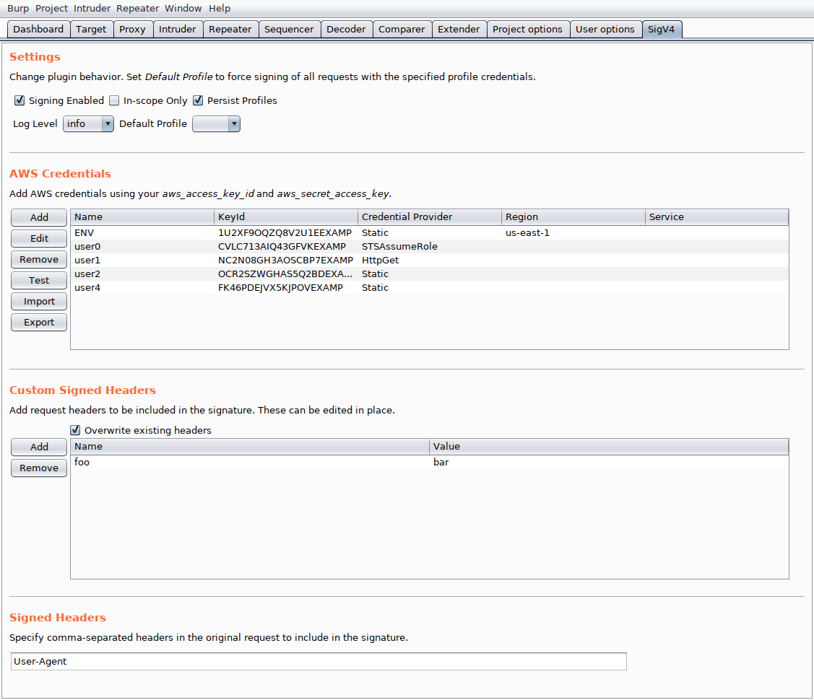
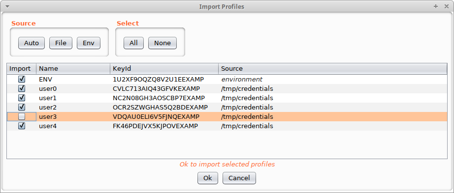
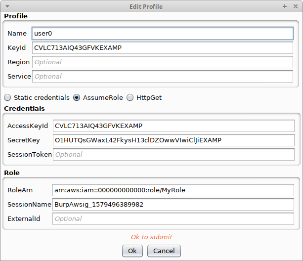

# AWS SigV4
This is a Burp extension for signing AWS requests with SigV4. Signature Version 4 is a process to add
authentication information to AWS HTTP requests. More information can be found here:
https://docs.aws.amazon.com/general/latest/gr/signature-version-4.html

SigV4 uses a timestamp to give signatures a limited lifetime. When using tools like Burp repeater,
this plugin will automatically compute a new signature with the current timestamp. You can also
repeat requests using different AWS credentials.

## Features
- Credentials can be imported from a file or environment variables.
- Automatically select a profile based on the key id in the request.
- Resend requests with different credentials.
- Context menu item for copying s3 presigned URLs.
- Assume a role by providing a role ARN and optional external ID


## Build Instructions
This assumes gradle is installed properly as well as a Java Development Kit.

```
$ ./gradlew bigJar
> Task :compileJava

BUILD SUCCESSFUL in 1s
2 actionable task: 2 executed
$ 
```

That will result in a newly created `build/libs` directory with a single JAR
containing all the dependencies named `aws-sigv4-<version>-all.jar`. This JAR can be
loaded into Burp using the Extender tab.

Loading the project up in IntelliJ IDEA should also make it easy to build the
source.


## Usage
Hit the "Import" button to open the credential import dialog. From there, you can choose a
file to import or select the "Auto" button to check default file locations and
the environment for credentials. See https://docs.aws.amazon.com/cli/latest/userguide/cli-configure-files.html#cli-configure-files-where
for expected file format. You can also manually add credentials by clicking "Add" in the main tab.
In addition to the credentials file, the plugin will also check if the profile exists in the config
file and it will pull in parameters from there.

At a minimum, a profile should contain a name and at least 1 credential provider. Outgoing requests
will be signed with the profile whose keyId matches the accessKeyId in the original request. If
the accessKeyId is not recognized, the message will be sent unmodified. Alternatively, a
"Default Profile" can be set which will be used to sign all outgoing requests regardless
of the original accessKeyId. The plugin will also look for the "X-BurpSigV4-Profile" HTTP header
for a profile name to use, with highest priority.

Region and service should almost always be left blank. This will ensure the region and
service in the original request are used which is desired in most cases. If your credential
or config file contains a region for a named profile, that will be used.

Profiles will be saved in the Burp settings store, including AWS keys, if "Persist Profiles"
is checked. You can also "Export" credentials to a file for importing later or for use
with the aws cli.

### Credentials

Configure profiles to obtain credentials in any of the following ways.

**Static Credentials**

Permanent credentials issued by IAM or temporary credentials with a session token can be
entered here.

**AssumeRole**

IAM roles can be assumed by entering a roleArn. Authorized credentials for calling sts:AssumeRole
should be entered in the "Credentials" form for assuming the specified role.

**HttpGet**

If you are retrieving credentials in some other manner, you can serve them over HTTP and
configure this form with the URL. An HTTP GET request will be issued to the URL and responses
will be expected in 1 of 2 formats:

```json
{
    "AccessKeyId": "<string>",
    "SecretAccessKey": "<string>"
}
```

or

```json
{
    "AccessKeyId": "<string>",
    "SecretAccessKey": "<string>",
    "SessionToken": "<string>",
    "Expiration": "<int>"
}
```

Permanent credentials (no "SessionToken") will be fetched every time they are used. Temporary credentials
will only be fetched when they are nearing expiration. Expiration should be specified in epoch seconds or
as an ISO 8601 timestamp.

**AWS Profile**

Fetch credentials from the files used by the AWS CLI ([docs](https://docs.aws.amazon.com/cli/latest/userguide/cli-configure-files.html)).

### Environment
https://docs.aws.amazon.com/cli/latest/userguide/cli-configure-envvars.html

The following environment variables are recognized:
- AWS_ACCESS_KEY_ID
- AWS_SECRET_ACCESS_KEY
- AWS_SESSION_TOKEN
- AWS_DEFAULT_REGION
- AWS_CONFIG_FILE
- AWS_SHARED_CREDENTIALS_FILE

If using the aws cli, set AWS_CA_BUNDLE to the path of your burp certificate (in PEM format).

## Screenshots

UI tab



Importing profiles



Editing a profile



## Development

Enable debug output for the aws sdk by adding the following property at the command line:

```
-Dorg.slf4j.simpleLogger.defaultLogLevel=trace
```
