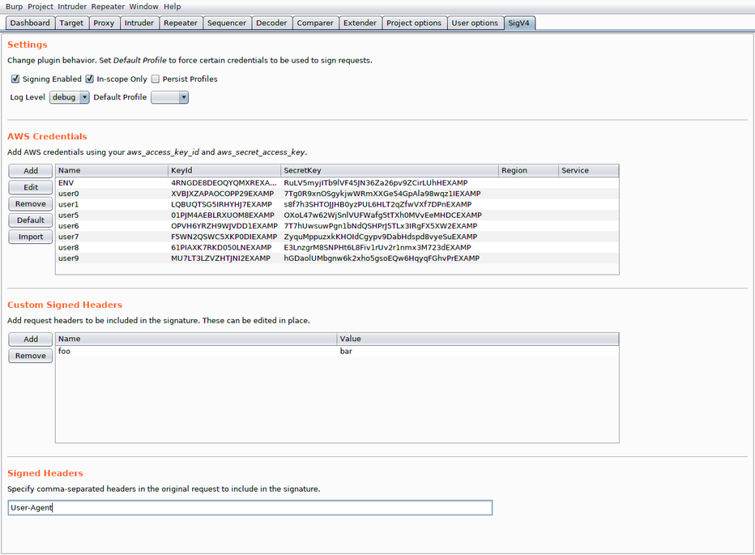
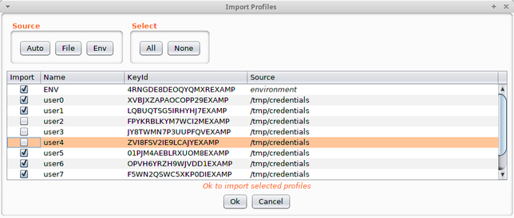

# awsig
This is a Burp extension for signing AWS requests with SigV4. Signature Version 4 is a process to add authentication information to AWS HTTP requests. More information can be found here: https://docs.aws.amazon.com/general/latest/gr/signature-version-4.html

SigV4 uses a timestamp to give signatures a lifetime of 15 minutes. When using tools like Burp repeater, awsig will automatically compute a new signature with the current timestamp. You can also repeat requests using different AWS credentials.

## Features
- Credentials can be imported from a file or environment variables.
- Profiles are automatically selected based on the key id in the request.
- Resend requests with different credentials.
- Supports signatures in query string parameters or headers (GET and POST).


## Build Instructions
This assumes maven is installed properly as well as a Java Development Kit.

```
$ cd src
$ mvn package
[INFO] Scanning for projects...
[INFO]
[INFO] ---------------------------< groupId:awsig >----------------------------
[INFO] Building awsig 1.0-SNAPSHOT
[INFO] --------------------------------[ jar ]---------------------------------
[...]
[INFO] BUILD SUCCESS
[INFO] ------------------------------------------------------------------------
[INFO] Total time:  1.590 s
[INFO] Finished at: 2019-04-10T08:31:35+02:00
[INFO] ------------------------------------------------------------------------
$ ls target
archive-tmp
awsig-1.0-SNAPSHOT.jar
classes
generated-sources
maven-archiver
maven-status
```

That will result in a newly created `target` directory with class files as well
as a single JAR containing all the dependencies named `awsig-<version>.jar`.
This JAR can be loaded into Burp using the Extender tab.

Loading the project up in IntelliJ IDEA should also make it easy to build the
source.


## Usage
Hit the "Import" button to import credentials from a file. See https://docs.aws.amazon.com/cli/latest/userguide/cli-configure-files.html#cli-configure-files-where
for expected file format. You can also manually add credentials by clicking "Add".

At a minimum, a profile should contain a name, keyId, and secretKey. Outgoing requests
will be signed with the profile associated with the keyId in the original request. If
the keyId is not recognized, the message will be sent unmodifed. Alternatively, a
"Default Profile" can be set which will be used to sign all outgoing requests regardless
of the original keyId.

Region and service should almost always be left blank. This will ensure the region and
service in the original request are used which is desired in most cases. If your credential
or config file contains a region for a named profile, that will be used.

Profiles will be saved in the Burp settings store, including AWS keys, if "Persist Profiles"
is checked. You can also "Export" credentials to a file for importing later or for use
with the aws cli.

### Environment
https://docs.aws.amazon.com/cli/latest/userguide/cli-configure-envvars.html

awsig respects the following environment variables:
- AWS_ACCESS_KEY_ID
- AWS_SECRET_ACCESS_KEY
- AWS_CONFIG_FILE
- AWS_SHARED_CREDENTIALS_FILE

If using the aws cli, set AWS_CA_BUNDLE to the path of your burp certificate (in PEM format).

## Screenshots

UI tab



Importing profiles


